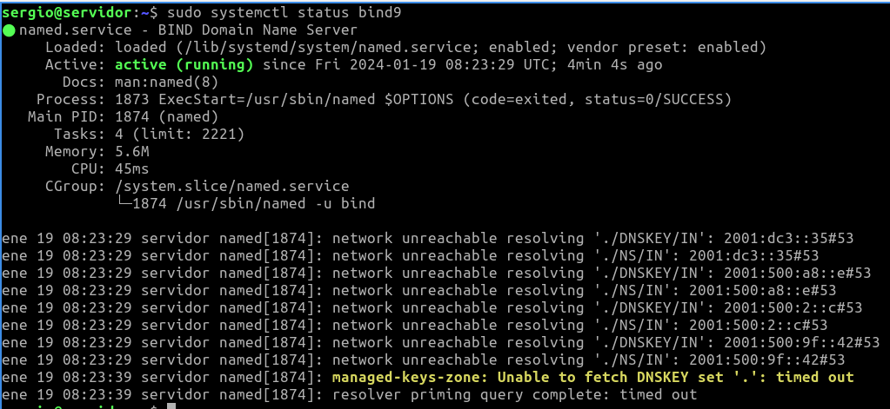
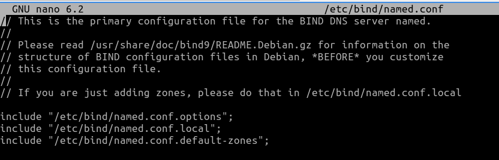
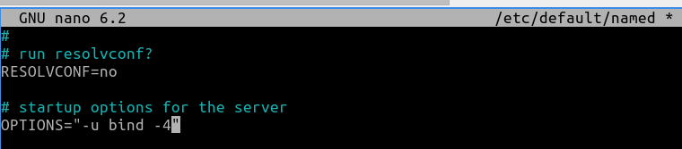
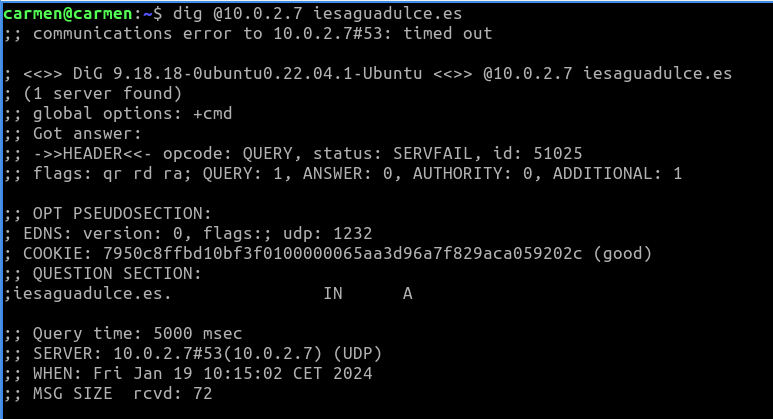
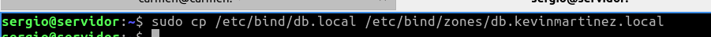
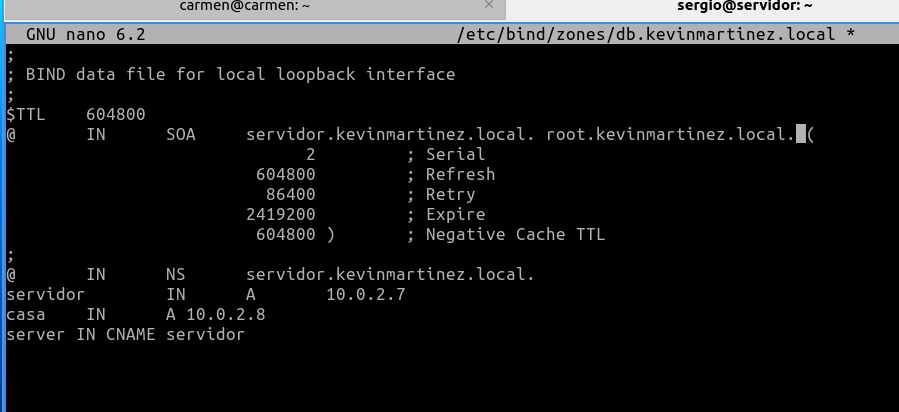
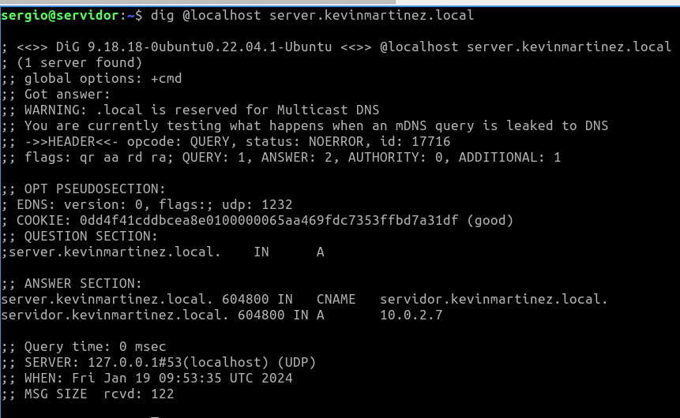

# Servicio de nombres de dominios
## Bind 9
* https://www.isc.org/bind/
* https://bind9.readthedocs.io/
* https://www.fpgenred.es/DNS/index.html
## Infraestructura
Reutilizaremos las MV de la práctica de **ssh**. Dos MV dentro de una **red NAT**:
* **Servidor**: con un Ubuntu server sin entorno gráfico.
    * Usuario: **sergio**, contraseña: **sergio**.
* **Casa**: con un Lubuntu con el entorno gráfico por defecto (LXQt).
    * Usuario: **carmen**, contraseña: **carmen**.

Desde el equipo **Casa** nos conectaremos al equipo **Servidor** mediante una conexión **ssh** autentificándonos
mediante claves asimétricas **ed25519**.
## Instalación y uso básico
1. Acceder al servidor:
```bash
ssh -i ~/.ssh/id_ed25519 10.0.2.4
```
> Casi toda la instalación y configuración la debemos hacer con privilegios de administrador
podemos ejecutar **sudo** en todas las instrucciones o cambiar al usuario administrador **sudo su**.

2. Instalar bind 9:
```bash
sudo apt update
sudo apt install bind9 bind9utils
```


> La instalación crea el usuario **bind** que ejecuta el servicio DNS denominado **named**. Puedes
comprobarlo mostrando el contenido del archivo **/etc/passwd**.


3. Comprobar estado del servicio **bind**:
```bash
sudo systemctl status bind9
```
> Muestra advertencias ya que aún no lo hemos configurado.



// NO REALIZAR EL PASO 4

4. Con los siguientes comandos lo activaremos para que se inicie al arrancar el servidor y lo iniciaremos:
```bash
sudo systemctl enable bind9
sudo systemctl start bind9
```
> Otras comandos del servicio son:
> ```bash
>sudo systemctl enable bind9
>sudo systemctl start bind9
>sudo systemctl stop bind9
>sudo systemctl restart bind9
>sudo systemctl status bind9
>sudo systemctl reload bind9
>sudo systemctl show bind9
>```

5. Reglas firewall:
```bash
sudo ufw enable
sudo ufw allow bind9
sudo ufw status
```


6. Probar desde el cliente qué puertos tiene abiertos el servidor, en nuestro ejemplo desde el equipo
**Casa** ejecutaremos:
```bash
nmap 10.0.2.4 -p 1-1024
```
> Por defecto el servicio DNS utiliza el puerto 53.

> Si no tienes instalada esta utilidad, instalalá con: **sudo apt install nmap**. Esta
comprobación también se puede hacer desde el propio servidor, pero es menos fiable que
desde otro equipo ya que puede conectarse por localhost.


7. Comprobar en el equipo **Servidor** qué conexiones tiene abiertas:
```bash
sudo ss -natp | grep named
sudo ss -naup | grep named
```


## Archivos de configuración
1. El archivo principal de configuración del **bind** es: **/etc/bind/named.conf**. En él vemos que hace
referencia a otros tres archivos de configuración:
    * **/etc/bind/named.conf.options**: hace referencia al archivo de configuración que posee opciones genéricas.
    * **/etc/bind/named.conf.local**: hace referencia al archivo de configuración para opciones particulares.
    * **/etc/bind/named.conf.default-zones**: hace referencia al archivo de configuración de zonas.

Abre el archivo y muesta estas referencias.
```bash
sudo nano /etc/bind/named.conf
```



## Verificar archivos de configuración
1. Puedes realizar una verificación de los ficheros de configuración y de zona por posibles fallos
mediante los comandos **named-checkconf** y **named-checkzone** respectivamente. Estos comandos
suelen ejecutarse con la siguiente sintaxis:
    * **named-checkconf [-p] {filename}**: Comprueba la sintaxis, pero no la semántica de un fichero de configuración named. El fichero se analiza y comprueba por errores de sintaxis, junto con todos los archivos incluidos en él.<br>
    Parámetros:
        * El parámetro **-p**: imprime la salida de named.conf y los ficheros incluidos en forma canónica si no fueron detectados errores.
        * **filename**: es el nombre del archivo de configuración que se desea comprobar. Si no se especifica, por defecto es **/etc/named.conf**.
    * **named-checkzone {zonename} {filename}**: Comprueba la sintaxis y la integridad de un archivo de zona. Realiza las mismas comprobaciones que hace named al cargar una zona. Esto hace que sea útil para comprobar los archivos de zona antes de configurarlos en un servidor de nombres.<br>
    Parámetros:
        * **zonename** es el nombre de dominio de la zona que se comprueba.
        * **filename** es el nombre del archivo de zona.

Prueba a verificar los siguientes archivos:

Verificar el fichero de configuración:
```bash
named-checkconf -p /etc/bind/named.conf
```


Verificar el dominio de zona ejemplo.com en el archivo de zona:
```bash
named-checkzone ejemplo.com /etc/bind//db.local
```


## Configurar servidor DNS
### Configurar Reenviadores (forwarders)
1. Primero indicar que cuando se ejecute **bind** lo haga solo sobre IPv4. Editar el archivo **named** y añadir **-4**.
```bash
sudo nano /etc/default/named
```
```bash
OPTIONS="-u bind -4"
```


2. Añadir al bloque **options** del archivo **named.conf.options** los reenviadores e indicar que no se validen las conexiones seguras DNS con las instrucciones siguientes:
```bash
sudo nano /etc/bind/named.conf.options
```
```bash
forwarders {
1.1.1.1;
8.8.8.8;
};
dnssec-validation no;
```


> En la siguiente dirección tienes unas estadísticas de velocidad de respuesta de distintos DNS: **DNSPerf**

3. Verificar el archivo anterior:
```bash
sudo named-checkconf /etc/bind/named.conf.options
```

Verificar el archivo de configuración principal **named.conf**:
```bash
sudo named-checkconf
```


4. Reiniciar el servicio **bind**:
```bash
sudo systemctl restart bind9
sudo systemctl status bind9
```


5. Los clientes ya pueden resolver **direcciones** externas manejadas por los reenviadores (forwarders).

Desde **Servidor**
```bash
dig @localhost iesaguadulce.es

o

dig @10.0.2.4 iesaguadulce.es
```


Desde **Casa**
```bash
dig @10.0.2.4 iesaguadulce.es
```


Ejecuta el comando anterior dos veces en cada equipo y comparar el tiempo de respuesta (Query
time)

### Configurar zonas
1. Editar el archivo **named.conf.local**
```bash
sudo nano `/etc/bind/named.conf.local`
```
Añade una zona con el formato **tuapellido.local**, por ejemplo: **garcia.local**, **lopez.local**. En este
ejemplo usaremos despliegue.local. Esta zona será de la red NAT creada en VirtualBox **10.0.2.0/24**.
Crea también su zona inversa.
```bash
zone "despliegue.local" IN {
type master;
file "/etc/bind/zones/db.despliegue.local";
};
zone "2.0.10.in-addr.arpa" {
type master;
file "/etc/bind/zones/db.2.0.10";
};
```


> RECUERDA: La ruta y los archivos indicados en la instrucción **file** no existen.

2. Verificar el archivo anterior:
```bash
sudo named-checkconf /etc/bind/named.conf.local
```


3. Crear la carpeta y los archivos de zonas (directa e inversa):
```bash
sudo mkdir /etc/bind/zones
```


4. Crear el archivo de la zona directa desde la plantilla db.local:
```bash
sudo cp /etc/bind/db.local /etc/bind/zones/db.despliegue.local
```


Editar la zona directa y añadir los equipos **casa** y **servidor**. Crea tambien un alias para servidor con el
nombre que quieras, en el ejemplo **server**.
```bash
sudo nano /etc/bind/zones/db.despliegue.local
```

```bash
;
; BIND data file for local loopback interface
;
$TTL 604800
@ IN SOA servidor.despliegue.local. root.despliegue.local. (
2 ; Serial
604800 ; Refresh
86400 ; Retry
2419200 ; Expire
604800 ) ; Negative Cache TTL
;
@ IN NS servidor.despliegue.local.
servidor IN A 10.0.2.4
casa IN A 10.0.2.7
server IN CNAME servidor
```


5. Verificar el archivo anterior:
```bash
sudo named-checkzone despliegue.local
/etc/bind/zones/db.despliegue.local
```


6. Crear el archivo de la zona inversa desde la plantilla **db.local** o desde el archivo de zona recién
creado:
```bash
sudo cp /etc/bind/db.local /etc/bind/zones/db.2.0.10

o

sudo cp /etc/bind/zones/db.despliegue.local /etc/bind/zones/db.2.0.10
```


Editar el archivo de la zona inversa
```bash
sudo nano /etc/bind/zones/db.2.0.10
```


```bash
;
; BIND reverse data file for local loopback interface
;
$TTL 604800
@ IN SOA servidor.despliegue.local. root.despliegue.local. (
2 ; Serial
604800 ; Refresh
86400 ; Retry
2419200 ; Expire
604800 ) ; Negative Cache TTL
;
@ IN NS servidor.despliegue.local.
4 IN PTR servidor.despliegue.local.
7 IN PTR casa.despliegue.local.
```


7. Verificar el archivo anterior:
```bash
sudo named-checkzone 2.0.10.in-addr.arpa /etc/bind/zones/db.2.0.10
```


8. Reiniciar el servicio **bind**:
```bash
sudo systemctl restart bind9
sudo systemctl status bind9
```


9. Los clientes ya pueden resolver direcciones de la **zona recién creada**.

Desde **Servidor**.
```bash
dig @localhost servidor.despliegue.local
dig @localhost casa.despliegue.local
dig @localhost server.despliegue.local

o

dig @10.0.2.4 servidor.despliegue.local
dig @10.0.2.4 casa.despliegue.local
dig @10.0.2.4 server.despliegue.local
```




Desde **Casa**.
```bash
dig @10.0.2.4 servidor.despliegue.local
dig @10.0.2.4 casa.despliegue.local
dig @10.0.2.4 server.despliegue.local
```


10. [OPCIONAL] Si queremos hacer resoluciones de nombres sin tener que escribir todo el nombre
(formato FQDN) y usar por ejemplo: **host casa** o **host servidor** necesitamos establecer el
dominio de búsqueda local. Como no tenemos configurado un servidor **DHCP** para recibir las
direcciones de los servidores de nombres y el dominio de búsqueda local, configuraremos a mano
estos datos en el archivo temporal **/etc/resolv.conf** tanto en **Servidor** como en **Casa**. Editar los
archivos **/etc/resolv.conf** en ambos equipos y añadir las primera y última línea:
```bash
sudo nano /etc/resolv.conf
```
```bash
nameserver 10.0.2.4
nameserver 127.0.0.53
options edns0 trust-ad
search despliegue.local
```


> El servidor de nombres (nameserver) y el dominio de búsqueda local (search) se puede
configurar en un DHCP de modo que se reciban estos datos junto con la configuración de red
(IP, máscara de red y gateway)

11. [OPCIONAL] Ya funciona la resolución usando el dominio de búsqueda local:
```bash
host iesaguadulce.es
host casa.despliegue.local
host casa
host servidor
host servidor.despliegue.local
host server
host server.despliegue.local
```
> El archivo **/etc/resolv.conf** es dinámico y ejecutar algunos comando como **dig** hacen que
se vuelva a actualizar con sus valores iniciales.